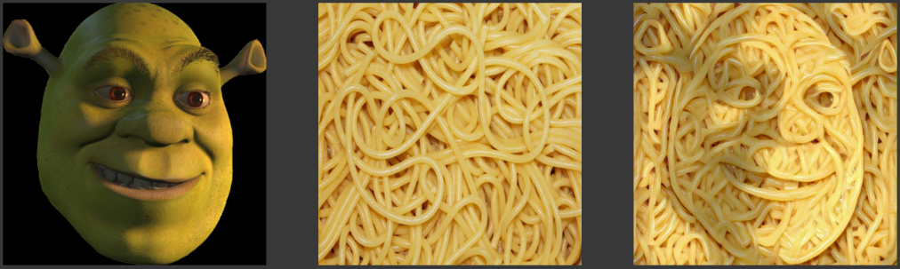
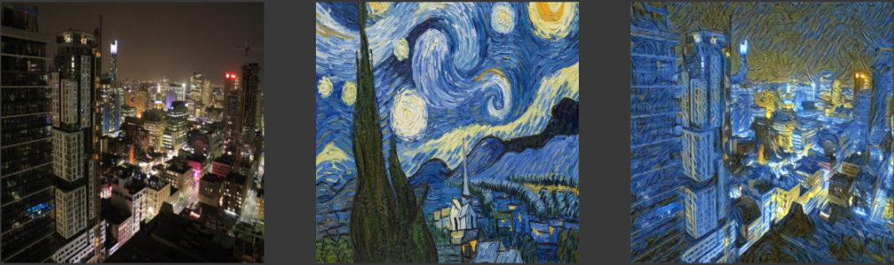

# Style Transfer

Simple Style Transfer using PyTorch

## Spaghetti Shrek

**Note:** Left image is the content image, Middle Image is the style image, and the right image is the style transfer applied resultant image

## Starry City

**Note:** Left image is the content image, Middle Image is the style image, and the right image is the style transfer applied resultant image

## Requirements

Python 3 and necessary libraries given in requirements.txt

Install the required libraries using the pip package manager.

For pip version 19.1 or above:

`pip install -r requirements.txt --user`

(or)

`pip3 install -r requirements.txt --user`

## Usage

Use the [style_transfer.py](style_transfer.py) script to run style transfer with your own images.

Example:

`python style_transfer.py --content 'Images/City.jpg' --style 'Images/StarryNight.jpg' --steps 6000 --size 512 --verbose 300 --save_vid True --output_folder results --output_name starry_bleh`
